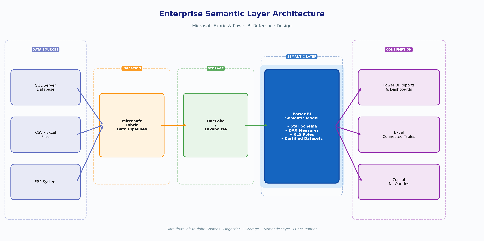
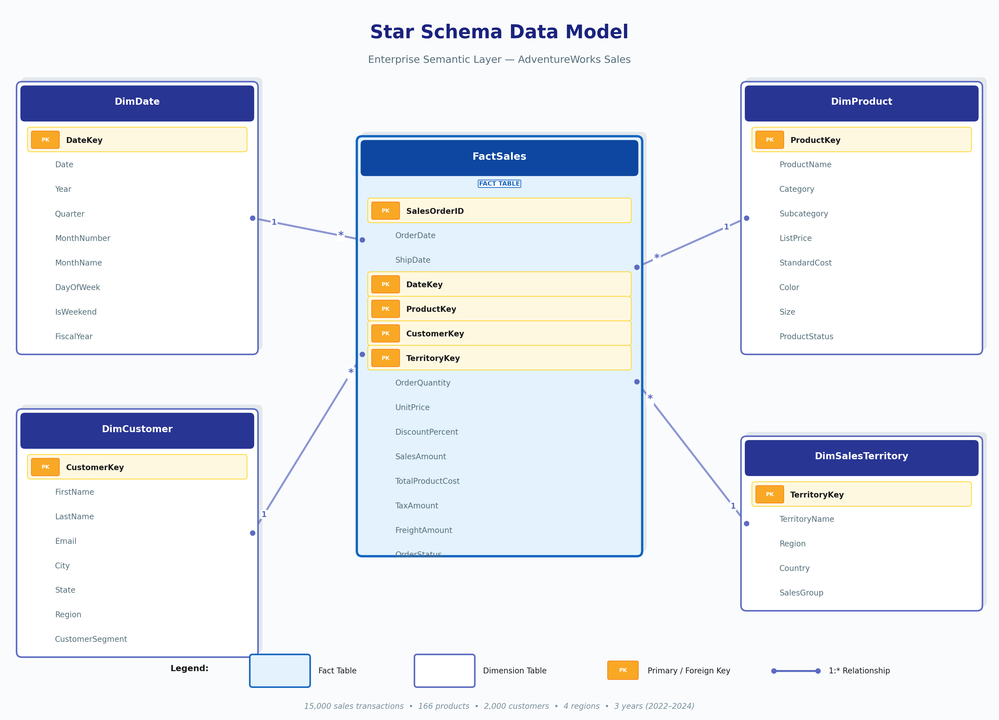
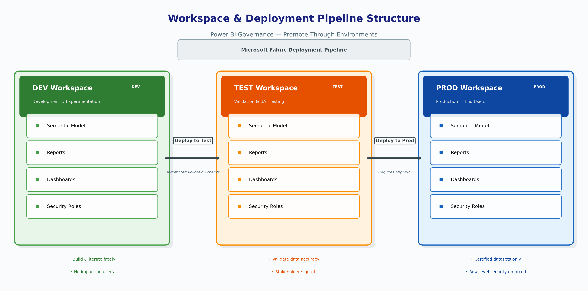

# Enterprise Semantic Layer & Governance Framework
## Overview A reference enterprise semantic layer architecture using Microsoft Fabric and Power BI. Implements a star schema with 15,000 sales transactions (~$20.9M revenue), reusable DAX measures, row-level security, workspace governance, and deployment pipelines.  
## Architecture   ## Data Model (Star Schema)   | Table | Rows | Role | |-------|------|------| | FactSales | 15,000 | Sales transactions (2022-2024) | | DimDate | 1,096 | Calendar dimension | | DimProduct | 166 | Products across 4 categories | | DimCustomer | 2,000 | Customers across 4 regions | | DimGeography | 30 | US cities and states | | DimSalesTerritory | 8 | Sales territories |
## DAX Measures Library | Measure | Formula | Purpose | |---------|---------|---------| | Total Revenue | SUM(FactSales[SalesAmount]) | Core revenue | | Gross Profit | [Revenue] - [Cost] | Profitability | | Profit Margin % | DIVIDE([Profit],[Revenue],0) | Margins | | YoY Growth | DATEADD year-over-year | Trends | | Avg Order Value | DIVIDE([Revenue],[Orders],0) | Order analysis |  
## Row-Level Security | Role | Filter | Data Visible | |------|--------|------| | Regional Mgr - West | [Region]="West" | West only | | Regional Mgr - East | [Region]="East" | East only | | Regional Mgr - Central | [Region]="Central" | Central only | | Executive | No filter | Full access |  ## Deployment Pipeline 
## Documentation - [Governance Framework](docs/governance-framework.md)
## Tools - Microsoft Fabric (Lakehouse, Data Pipelines) - Power BI Desktop (Semantic Model, DAX, RLS) - Draw.io (Architecture Diagrams)  
## Getting Started 1. Clone this repo 2. Open pbix/semantic-layer-demo.pbix in Power BI Desktop 3. Review the star schema in Model view 4. Test RLS: Modeling > View as Roles